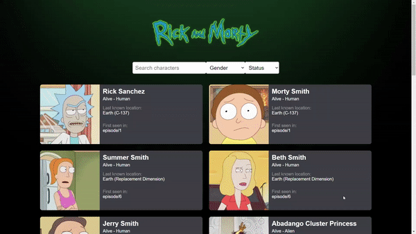

# Trendyol Front-End Bootcamp | ReactJS Assignment
React project that uses the [Rick and Morty API](https://rickandmortyapi.com/) to show and filter characters 

## Built With
- ReactJS
- Rick and Morty API

## How to install
- clone project
```sh
git clone https://github.com/Trendyol-Front-End-Bootcamp/week-3-react-mahmud-mardini.git
```

- Install dependencies
```sh
npm install
```

- run the app
```sh
npm run start
```

## Preview

